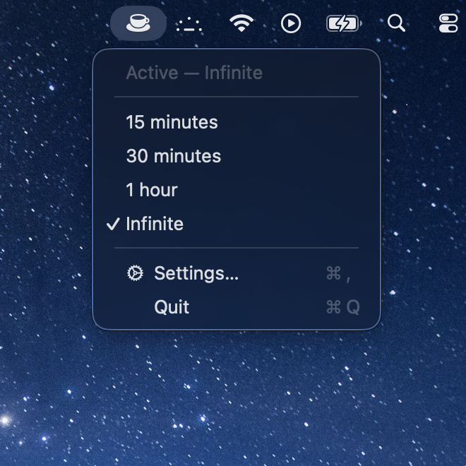

# Caffeine

A macOS menubar app to manage the `caffeinate` command — keep your Mac awake
with preset timers (15 min, 30 min, 1 hour, Infinite).

## Screenshot



## Build

Building the app bundle (`./build.sh` → `swift build`) needs only the Swift 6
Command Line Tools. `build.sh` also generates `AppIcon.icns` from
`Resources/AppIcon.png` (via `sips` + `iconutil`) and embeds it in the bundle.

```bash
./build.sh
open Caffeine.app
```

To install, drag `Caffeine.app` into `/Applications`.

## Features

- Preset timers with visible countdown
- State-aware menubar icon (SF Symbol coffee cup)
- Custom app icon in Finder / Login Items
- Configurable keep-awake mode (display only / display + system) in Settings
- Launch at login

## Development

Running the unit tests requires the full Xcode toolchain (XCTest ships with
Xcode, not the standalone Command Line Tools):

```bash
swift test      # run unit tests (needs full Xcode)
swift run Caffeine   # run without bundling
```

To change the app icon, replace `Resources/AppIcon.png` (1024×1024) and rerun
`./build.sh`.

## Known limitations

- Changing the keep-awake mode in Settings applies to the next activation; if
  a timer is already running, the current session keeps the mode it started
  with.

## License

Released under the [MIT License](LICENSE).
